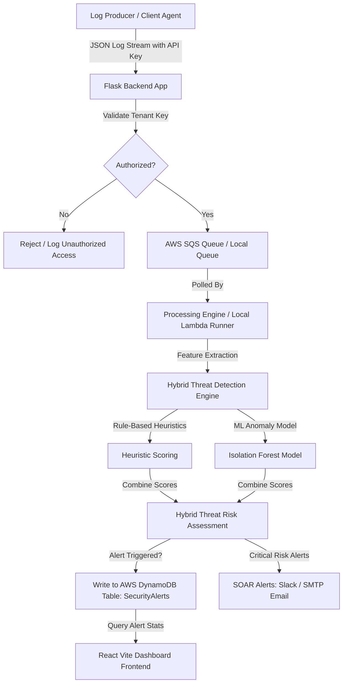

# 🛡️ Cloud Log Analyzer & SIEM Engine

[](https://www.python.org/)
[](https://react.dev/)
[](https://vitejs.dev/)
[](https://aws.amazon.com/)
[](https://opensource.org/licenses/MIT)

An enterprise-inspired, multi-tenant Security Information and Event Management (SIEM) log analysis system. This application ingests simulated authentication logs, executes hybrid threat detection (rule-based heuristics + Machine Learning anomaly detection using Isolation Forest), pushes alerts into Amazon DynamoDB, sends critical mail/Slack alerts, and visualizes security metrics in real-time through an interactive React dashboard.

---

## 🏗️ Architecture Overview



### 🛰️ The Data Pipeline & SOAR Workflow
1. **Ingest**: Logs are generated by `sqs_producer.py` representing standard network events and malicious actions, sending them via `POST` requests to the Flask API.
2. **Buffer**: Flask validates the client's custom `X-API-Key`, appends tenant metadata, and routes the data safely into an **Amazon SQS Queue**.
3. **Analyze**: The local worker `local_lambda_runner.py` (or the production-ready AWS Lambda handler `LAMBDA_CODE_FOR_DEPLOYMENT.py`) pulls messages off SQS and processes them.
4. **Evaluate (Hybrid Detection)**:
   - **Heuristics Engine**: Evaluates rule thresholds (failed login count, password spraying, velocity abuse, geovelocity travel anomalies).
   - **Isolation Forest Model**: Fits log feature profiles (`login_hour`, `failed_attempts`, `ip_count`, `failure_ratio`) to score anomalies.
   - **Scoring Blend**: Evaluates security risk scores using a weighted hybrid formula: $S_h = \alpha \cdot S_r + (1 - \alpha) \cdot S_a$.
5. **Alert & Store**: High/critical alerts trigger automated Slack hooks and SMTP emails, then register in DynamoDB `SecurityAlerts`.
6. **Visualize**: Tenants and Admins access their dedicated panel on the React dashboard to analyze incidents, download PDF audit reports, or manage keys.

---

## ⚙️ Tech Stack & Dependencies

*   **Backend Engine**: Python 3.9+, Flask, Boto3 (AWS SDK), PyJWT (Authentication), Bcrypt, FPDF (PDF Reports), Python-Dotenv.
*   **Security & Database**: AWS SQS (Message Queueing), AWS DynamoDB (Multi-tenant structured store), AWS S3 (Log backup & ML model hosting), AWS STS (Role delegation/cross-account access).
*   **Machine Learning**: Scikit-Learn (Isolation Forest), Joblib, NumPy, Pandas.
*   **Frontend Dashboard**: React 19, Vite, Chart.js & React-Chartjs-2 (Visual graphs), Lucide React (Icons), React Router DOM, React Simple Maps.

---

## 📂 Project Directory Structure

```text
├── backend/
│   ├── app.py                # Core Flask backend API & tenant router
│   ├── requirements.txt      # Backend Python dependencies
│   ├── s3_upload.py          # Log archival script (AWS S3)
│   ├── scheduler.py          # Background tasks scheduler
│   └── local_alerts.json     # Local database fallback for alerts
├── dashboard/
│   ├── src/                  # React dashboard source files
│   │   ├── components/       # Reusable layout and telemetry widgets
│   │   ├── pages/            # Login, Admin, Tenant Portal interfaces
│   │   ├── services/         # API connector wrappers
│   │   └── App.jsx           # Main router & app setup
│   ├── package.json          # Node dependencies
│   └── vite.config.js        # Vite configurations
├── ml/                       # Local model playground (Legacy/Dev)
├── ml-model/                 # ML Deployment microservice workspace
│   ├── train_model.py        # Model trainer execution script
│   └── Dockerfile            # Container configuration for ML hosting
├── scripts/
│   ├── create_dynamodb_tables.py   # Deletes and creates Companies, SecurityAlerts, & ProcessedLogs
│   └── seed_companies.py           # Populates initial testing tenants
├── LAMBDA_CODE_FOR_DEPLOYMENT.py   # Production AWS Lambda anomaly detection handler
├── local_lambda_runner.py          # Local runner that acts as the Lambda parser (SQS -> DynamoDB)
├── sqs_producer.py                 # Traffic simulator stream script (mixed/attack/normal logs)
├── feature_extraction.py           # Feature engineering and risk scoring algorithms
└── EXECUTION_GUIDE.md              # Project manual setup walkthrough
```

---

## 🔧 Environment Configuration

Create a `.env` file in the root directory:

```env
# AWS Infrastructure Keys
AWS_ACCESS_KEY_ID=your_aws_access_key
AWS_SECRET_ACCESS_KEY=your_aws_secret_key
SQS_QUEUE_URL=https://sqs.us-east-1.amazonaws.com/your-account-id/your-queue-name

# Backend Configuration
SIEM_URL=http://localhost:5000/api/ingest
SIEM_API_KEY=generated_on_registration_portal

# Security
JWT_SECRET=super-secret-enterprise-key-123!
SUPER_ADMIN_PASSWORD=admin123

# Slack & SMTP Notifications (Optional)
SLACK_WEBHOOK_URL=https://hooks.slack.com/services/...
GMAIL_USER=your_alerts_email@gmail.com
GMAIL_PASS=your_app_specific_gmail_password
```

Create a dashboard-specific environmental file in `dashboard/.env`:

```env
VITE_API_URL=http://localhost:5000
```

---

## 🚀 Step-by-Step Setup Guide

### 1. Database Provisioning
Run the table creation script to set up Amazon DynamoDB tables (`Companies`, `SecurityAlerts`, `ProcessedLogs`):
```bash
python scripts/create_dynamodb_tables.py
```

### 2. Seeding Initial Tenants
To run with demo companies preloaded:
```bash
python scripts/seed_companies.py
```

### 3. Startup Backend Server
```bash
cd backend
pip install -r requirements.txt
python app.py
```
*The backend API initializes on `http://localhost:5000`.*

### 4. Run Dashboard Frontend
In a separate terminal shell:
```bash
cd dashboard
npm install
npm run dev
```
*Launch your browser and visit `http://localhost:5173`.*

### 5. Start Log Streaming (Traffic Simulator)
Generate traffic batches to simulate standard employee usage and real-time security threats:
```bash
# Stream mixed logs (30% attack vectors, 70% normal actions)
python sqs_producer.py --mode mixed

# Other options: normal_only, attack_only
```

### 6. Boot the Log Processor
In another terminal shell, start the processing loop which polls messages from AWS SQS, processes them via feature extraction, scores the threats, and puts results into DynamoDB:
```bash
python local_lambda_runner.py
```
You will immediately see processed alerts visualising on your React frontend charts!

---

## 🧠 Detection Logic & Risk Calculation

### Engineered Features
The ML pipeline extracts 4 critical feature variables from log streams aggregated by user over a 15-minute timeframe:
1. **Average Login Hour**: The mean hour index of logins ($0.0 - 24.0$).
2. **Failed Attempts**: Total count of login failures.
3. **Unique IP Count**: The number of distinct network IPs utilized by the user.
4. **Failure Ratio**: The ratio of failed logins to total login operations ($0.0 - 1.0$).

### Formulaic Weighted Risk Engine
Risk evaluates through a blended combination of heuristics rules and machine learning Isolation Forest predictions:

1. **Rule-Based Suspicion ($S_r$)**:
   - $0$ alerts: $S_r = -1.0$ (safe)
   - $1$ alert: $S_r = -0.5$
   - $2$ alerts: $S_r = 0.0$
   - $\ge 3$ alerts: $S_r = \min(0.5 + (count - 3) \times 0.25, 1.0)$
2. **ML Suspicion ($S_a$)**: Matches Isolation Forest outputs to continuous margins.
3. **Hybrid Security Risk Score ($S_h$)**:
   $$S_h = \alpha \cdot S_r + (1 - \alpha) \cdot S_a$$
   *(Default weight parameter: $\alpha = 0.6$)*
4. **Final Security Risk Mapping**:
   $$\text{Risk Score} = (S_h + 1) \times 50$$
   *   **LOW**: $< 30$
   *   **MEDIUM**: $30 \le \text{Risk} < 60$
   *   **HIGH**: $60 \le \text{Risk} < 85$
   *   **CRITICAL**: $\text{Risk} \ge 85$

---

## 🧪 Integration & Validation Testing

Verify system functionalities, API edge cases, and AWS permissions with the integration tests:

*   **E2E Integration & ML Score Verification**:
    ```bash
    python test_end_to_end.py
    ```
*   **Lambda Handler Edge Cases**:
    ```bash
    python test_lambda_edge_cases.py
    ```
*   **Slack Webhook Hook Test**:
    ```bash
    python test_slack.py
    ```
*   **ML Feature Integration Tests**:
    ```bash
    python test_week6_ml_integration.py
    ```

---

## 📄 License

Distributed under the MIT License. See `LICENSE` for details.
